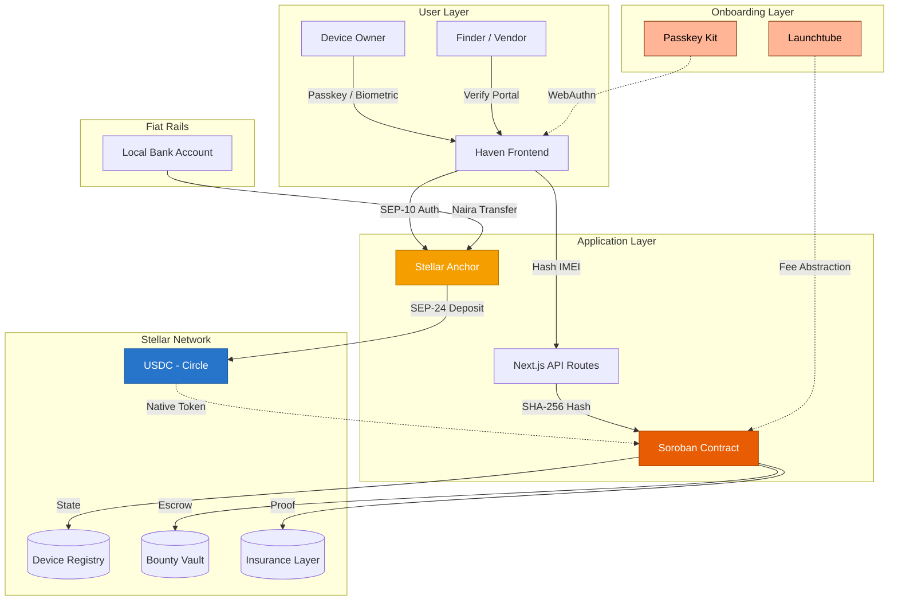

<div align="center">
  <h1>🛡️ Haven</h1>
  <p><strong>The Decentralized Device Registry on Stellar</strong></p>
  <p>Making smartphone theft economically unviable through trustless bounties, cryptographic proof-of-loss, and native stablecoin escrow.</p>

  <br />

  [](https://opensource.org/licenses/MIT)
  [](https://stellar.org)
  [](https://soroban.stellar.org)
  [](./CONTRIBUTING.md)
</div>

---

## 🎯 The Problem

Smartphone theft in emerging markets is a **$1B+ problem**. In Lagos alone, a stolen phone is wiped, re-flashed, and resold in secondary markets within hours. Existing solutions — IMEI blacklists, Find My Phone, carrier locks — are **reactive, centralized, and easily circumvented**.

The black market wins because the economics favor it: a fence pays cash immediately, and the infrastructure to verify stolen goods simply doesn't exist at the point of sale.

## 💡 The Haven Solution

Haven doesn't track stolen devices. Haven makes them **economically worthless** to the black market by fundamentally changing the incentive structure:

1. **Bind devices to on-chain identities** — SHA-256 hashed IMEIs become stateful Soroban assets. The raw IMEI never touches the chain.
2. **Offer trustless bounties that outbid the black market** — When a device is stolen, the owner locks a USDC bounty in a Soroban escrow contract. A vendor or finder who returns the device gets paid automatically — no trust, no middlemen.
3. **Provide cryptographic proof-of-loss for insurers** — Immutable on-chain evidence eliminates double-dipping fraud and gives insurance providers a verifiable claims layer.

---

## 🏗️ System Architecture



### Core Data Flow

| Step | Action | Layer |
|------|--------|-------|
| **1. Register** | User enters IMEI → API route hashes it (SHA-256) → Soroban stores the hash as a `DeviceState` | On-chain |
| **2. Killswitch** | Owner reports stolen → Contract freezes the asset → USDC bounty deposited to escrow | On-chain |
| **3. Fund Bounty** | Owner clicks "Fund with Bank Transfer" → SEP-24 Anchor handles Naira → USDC conversion → Funds hit escrow | Fiat → On-chain |
| **4. Recovery** | Finder contacts owner → Owner confirms → Contract releases bounty to finder's Stellar address | On-chain |
| **5. Insurance** | Owner files claim → Contract transfers device authority to insurer → Immutable proof-of-loss generated | On-chain |

---

## 🔑 Why Stellar?

Haven is purpose-built for Stellar because no other chain provides this combination of features for our specific market:

### Native USDC (Circle)

Bounties are priced in **stable USDC**, not volatile tokens. A finder in Computer Village, Lagos knows *exactly* what they'll earn for returning a device — $20, not "0.003 ETH that might be $18 or $22 by the time they cash out."

### SEP-24 Fiat On-Ramps — The Killer Feature

This is what makes Haven work in Nigeria (and any emerging market):

```
┌──────────────────────────────────────────────────────────────┐
│                  The Bounty Funding Flow                      │
│                                                               │
│  1. User clicks "Fund Bounty with Bank Transfer"              │
│  2. Haven authenticates user with Anchor (SEP-10)             │
│  3. Anchor returns a URL → opens in-app webview               │
│  4. User makes a standard Naira bank transfer to Anchor       │
│  5. Anchor drops equivalent USDC into Soroban escrow          │
│                                                               │
│  Result: User funded a crypto escrow using their local        │
│  bank account. No exchange. No bridge. No seed phrase.        │
└──────────────────────────────────────────────────────────────┘
```

**Why this matters:**
- **Zero KYC/compliance liability** for Haven — the Anchor handles all regulatory requirements
- **Users stay inside the Haven app** — no redirect to a third-party exchange
- **Instant global scaling** — implement SEP-24 once, connect to any compliant Anchor worldwide. Expand to Kenya or Ghana without rewriting your payment gateway.

### Account Abstraction & Smart Wallets

Stellar has **native account abstraction** via Soroban's programmable `__check_auth`. Haven uses:

| Tool | Purpose | Equivalent |
|------|---------|------------|
| **Passkey Kit** | WebAuthn/biometric smart wallets — users sign with FaceID or fingerprint | Privy embedded wallets |
| **Launchtube** | Fee abstraction relay — sponsors transaction fees for users | Paymaster / gas sponsorship |
| **Freighter** | Browser extension wallet for B2B integrations (insurance providers, vendors) | MetaMask / Phantom |

No seed phrases. No gas tokens. A user signs up with a biometric passkey, and a Stellar keypair is generated under the hood.

### Sub-Cent Transaction Fees

Registering a device on Haven costs fractions of a cent. This is critical for mass-market adoption in price-sensitive markets.

### Enterprise Trust

When pitching Haven to insurance providers as their proof-of-loss infrastructure, Stellar's reputation for **enterprise compliance** and **institutional trust** removes friction that more volatile, retail-heavy chains introduce.

---

## 📁 Project Structure

The project is organized as **two separate repositories** under the [HavenOnStellar](https://github.com/HavenOnStellar) GitHub organization:

### [`haven-contracts`](https://github.com/HavenOnStellar/Haven_Contracts)

```
contracts/
├── Cargo.toml                      # Rust workspace root
├── README.md                       # Contract-specific docs
└── contracts/
    └── haven_registry/             # Main registry contract
        ├── Cargo.toml
        └── src/
            ├── lib.rs              # Entry point, DataKey enum, DeviceState struct
            ├── device.rs           # register_device(), get_device()
            ├── killswitch.rs       # report_stolen(), get_bounty()
            ├── recovery.rs         # confirm_recovery()
            ├── insurance.rs        # file_insurance_claim()
            └── test.rs             # 9 passing tests
```

### [`haven-frontend`](https://github.com/HavenOnStellar/Haven_Frontend)

```
frontend/
├── package.json                    # Next.js 16 + Stellar SDK
└── src/app/
    ├── globals.css                 # Design system (dark mode, amber gradients)
    ├── layout.tsx                  # SEO, fonts, metadata
    ├── page.tsx                    # Landing page
    └── lib/
        └── havenClient.ts          # Stellar SDK client stub
```

---

## ⚡ Quick Start

### Prerequisites

| Tool | Version | Install |
|------|---------|---------|
| **Node.js** | 18+ | [nodejs.org](https://nodejs.org/) |
| **Rust** | 1.84+ | [rustup.rs](https://rustup.rs/) |
| **Wasm Target** | — | `rustup target add wasm32v1-none` |
| **Stellar CLI** | Latest | `cargo install --locked stellar-cli --features opt` |

### 1. Clone the Repositories

The project is split into two repositories under the [HavenOnStellar](https://github.com/HavenOnStellar) organization:

```bash
# Smart Contracts
git clone https://github.com/HavenOnStellar/Haven_Contracts.git

# Frontend
git clone https://github.com/HavenOnStellar/Haven_Frontend.git
```

### 2. Smart Contracts

```bash
cd haven-contracts

# Verify compilation
cargo check

# Run tests (9 tests, all passing)
cargo test

# Build WASM binary
stellar contract build
```

### 3. Deploy to Testnet

```bash
# Generate a keypair
stellar keys generate --global haven-deployer --network testnet

# Fund the account
stellar keys fund haven-deployer --network testnet

# Deploy
stellar contract deploy \
  --wasm target/wasm32v1-none/release/haven_registry.wasm \
  --source haven-deployer \
  --network testnet

# Initialize
stellar contract invoke \
  --id <CONTRACT_ID> \
  --source haven-deployer \
  --network testnet \
  -- \
  initialize \
  --admin <YOUR_PUBLIC_KEY>
```

### 4. Frontend

```bash
cd haven-frontend

# Install dependencies
npm install

# Run development server
npm run dev
```

Open [http://localhost:3000](http://localhost:3000) to see the landing page.

### 5. Deployed Testnet Contract

The registry contract is currently deployed on the Stellar Testnet at:

- **Contract ID:** `CAT2TDBXGW6GETW52MQB725PLWN2CBVO3TXJ7PRJ73YSKLHRA7SRN6FC`
- **Network Explorer:** [Stellar Expert](https://stellar.expert/explorer/testnet/contract/CAT2TDBXGW6GETW52MQB725PLWN2CBVO3TXJ7PRJ73YSKLHRA7SRN6FC)

You can use this Contract ID in the frontend to interact with the deployed registry.

---

## 🗺️ Roadmap

### Phase 1: Core Registry *(Current — Skeleton)*
- [x] Soroban contract architecture (device, killswitch, recovery, insurance)
- [x] On-chain `DeviceState` with hashed IMEI storage
- [x] Skeleton test suite — 9 passing tests
- [x] Next.js landing page with premium dark-mode UI
- [x] Stellar SDK client stub with TypeScript types
- [ ] Implement SAC token transfers for USDC bounty escrow
- [ ] Deploy to Stellar Testnet
- [ ] Emit contract events for off-chain indexers

### Phase 2: Wallet & Onboarding
- [ ] Passkey Kit integration — biometric smart wallets (no seed phrases)
- [ ] Launchtube integration — fee abstraction for gasless UX
- [ ] Freighter integration — B2B wallet for vendors and insurers
- [ ] User dashboard — device management, bounty status, recovery history

### Phase 3: Fiat On-Ramps & Escrow
- [ ] SEP-10 authentication with Stellar Anchors
- [ ] SEP-24 interactive deposit flow — Naira → USDC via in-app webview
- [ ] Full bounty lifecycle — fund, freeze, release, refund
- [ ] Vendor verification portal — rate-limited public device lookup

### Phase 4: Insurance & B2B Layer
- [ ] Multi-sig insurance claims (owner + insurer co-sign)
- [ ] Salvage and device authority transfer
- [ ] Insurance provider dashboard & proof-of-loss API
- [ ] Batch device registration for enterprise fleets

### Phase 5: Mass Market Scaling
- [ ] Mobile app (React Native / Expo) with IMEI auto-read
- [ ] Multi-anchor support — connect to anchors in Kenya, Ghana, South Africa
- [ ] Zero-knowledge recovery — prove ownership without exposing PII
- [ ] On-chain governance for protocol parameters

---

## 🧠 Smart Contract Architecture

### Contract: `HavenRegistry`

| Module | Functions | Description |
|--------|-----------|-------------|
| **`device.rs`** | `register_device()`, `get_device()` | Ingests SHA-256 hashed IMEI, creates `DeviceState`, increments device counter |
| **`killswitch.rs`** | `report_stolen()`, `get_bounty()` | Flips `is_stolen`, stores recovery contact, records bounty escrow amount |
| **`recovery.rs`** | `confirm_recovery()` | Flips `is_stolen` back, releases escrowed bounty to finder's address |
| **`insurance.rs`** | `file_insurance_claim()` | Transfers device authority to insurer, creates immutable proof-of-loss |

### `DeviceState` (On-Chain)

```rust
pub struct DeviceState {
    pub owner: Address,           // Device owner's Stellar address
    pub hashed_imei: BytesN<32>,  // SHA-256 hash (raw IMEI never on-chain)
    pub device_model: String,     // "iPhone 15 Pro", "Samsung Galaxy S24"
    pub is_stolen: bool,          // The killswitch flag
    pub registered_at: u32,       // Ledger sequence at registration
    pub recovery_contact: String, // Email/phone for finder to reach owner
    pub insurer: Option<Address>, // Set when insurance claim is filed
}
```

### Storage Keys

```rust
pub enum DataKey {
    Admin,                    // Contract administrator
    Device(BytesN<32>),       // Hashed IMEI → DeviceState
    Bounty(BytesN<32>),       // Hashed IMEI → Escrowed amount
    DeviceCount,              // Total registered devices
}
```

---

## 🤝 Contributing

Haven is built to be contributed to. The codebase is intentionally full of `// TODO:` markers — each one is a clearly scoped contribution opportunity.

```bash
# Find all contribution opportunities
grep -rn "TODO" contracts/ frontend/src/
```

### Good First Issues

| Area | Task | File |
|------|------|------|
| **Contracts** | Implement SAC token transfers for bounty deposit | `killswitch.rs` |
| **Contracts** | Add event emission for device registration | `device.rs` |
| **Contracts** | Add time-lock for recovery (prevent bounty gaming) | `recovery.rs` |
| **Contracts** | Multi-sig insurance claims | `insurance.rs` |
| **Frontend** | Build the vendor verification page | `frontend/src/app/verify/` |
| **Frontend** | Implement Passkey Kit onboarding flow | `frontend/src/app/` |
| **Frontend** | Wire up Freighter wallet for B2B users | `havenClient.ts` |
| **Infra** | SEP-24 Anchor integration for fiat on-ramps | New module |

See **[CONTRIBUTING.md](./CONTRIBUTING.md)** for the full guide including branch naming, commit conventions, and code style.

---

## 🛠️ Technology Stack

| Layer | Technology | Purpose |
|-------|-----------|---------|
| **Smart Contracts** | Rust + Soroban SDK | On-chain device registry, bounty escrow, insurance logic |
| **Frontend** | Next.js 16 + TypeScript | Landing page, user dashboard (future), API routes |
| **Styling** | Tailwind CSS v4 | Dark-mode design system with Material Design 3 tokens |
| **Wallet (Consumer)** | Passkey Kit + Launchtube | Biometric smart wallets with fee abstraction |
| **Wallet (B2B)** | Freighter | Browser extension for vendors and insurance providers |
| **Stablecoin** | Native USDC (Circle) | Stable-value bounties — no volatile tokens |
| **Fiat Rails** | SEP-24 Stellar Anchors | Local currency deposits → on-chain USDC |
| **Client SDK** | @stellar/stellar-sdk | Frontend ↔ Soroban contract interaction |

---

<div align="center">
  <i>Built with ❤️ to defeat the black market.</i>
  <br /><br />
  <a href="https://github.com/HavenOnStellar/Haven_Contracts/issues">Report a Bug</a> · <a href="https://github.com/HavenOnStellar/Haven_Frontend/issues">Request a Feature</a> · <a href="./CONTRIBUTING.md">Contribute</a>
</div>
